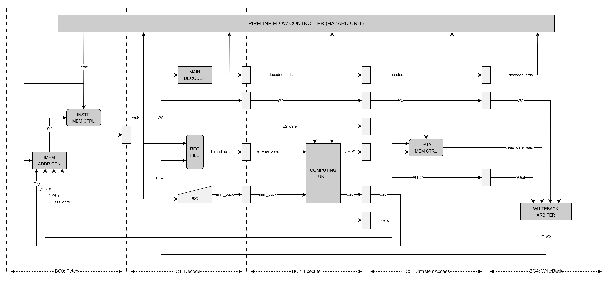

= Banana Core Specification
:doctype: book
:toc:
:toclevels: 3
:sectnums:

== Overview

TBD

=== Features

TBD

=== Suported Extensions

TBD

== Microarchitecture

TBD

=== Top level

TBD

.Top level microarchitecture diagram

[NOTE]
On this diagram, interfaces denoted via normal text and simple wires with italic text.

[NOTE]
No pipeline registers at BC1 and BC4 (after data memory) presented as instruction memory and data memory have synchronous read ports.

=== Compute Unit

TBD

=== TBD more units

TBD

== Intefaces

TBD

=== External interfaces

TBD

=== Internal interfaces

TBD

=== Pipeline interfaces

Pipeline interfaces is used only to carry information between pipeline stages.
Pipeline interfaces have no validity, credit or any other information rather than payload itself.
All information are only transfered one way.

==== decoded_ctrls interface

This interface is used to carry control signals generated by main decoder to all modules within pipeline.

.decoded_ctrls interface payload
[%autowidth]
|===
| Signal | Type | Description

| alu_opcode
| alu_opcode_t
| opcode for ALU

| wb_rf_we
| logic
| write to RF destination register will be completed iff this signal is asserted

| wb_rf_addr
| logic [RF_ADDR_WIDTH - 1:0]
| addr of RF destination register

| TBD
| TBD
| TBD

| is_jump_instr
| logic
| indicates that decoded instruction is jump

| is_branch_instr
| logic
| indicates that decoded instruction is branch
|===

==== rf_wb interface

This interface is used to carry write-back information from writeback arbiter to register file.

.rf_wb interface payload
[%autowidth]
|===
| Signal | Type | Description

| rd_we
| logic
| write to destination register will be completed iff this signal is asserted

| rd_addr
| logic [RF_ADDR_WIDTH - 1:0]
| addr of destination register

| rd_data
| logic [DATA_WIDTH - 1:0]
| data to be written to destination register
|===

== Control and Status Registers

TBD
